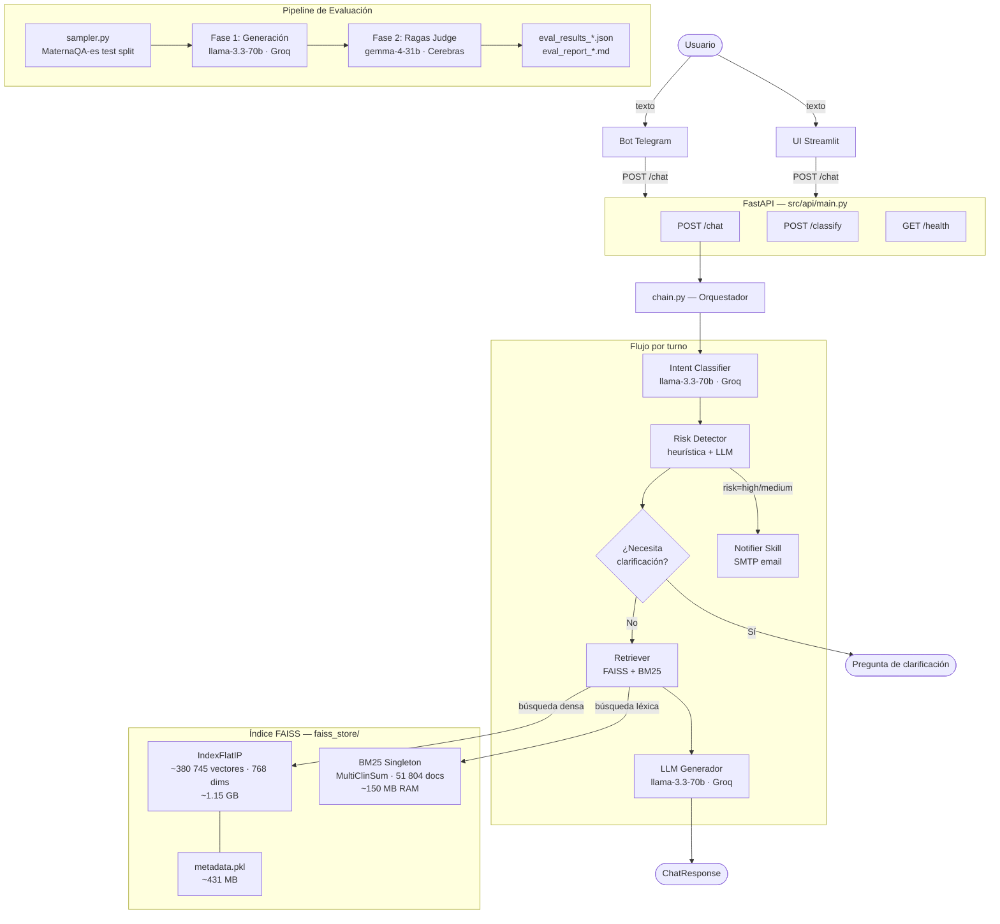
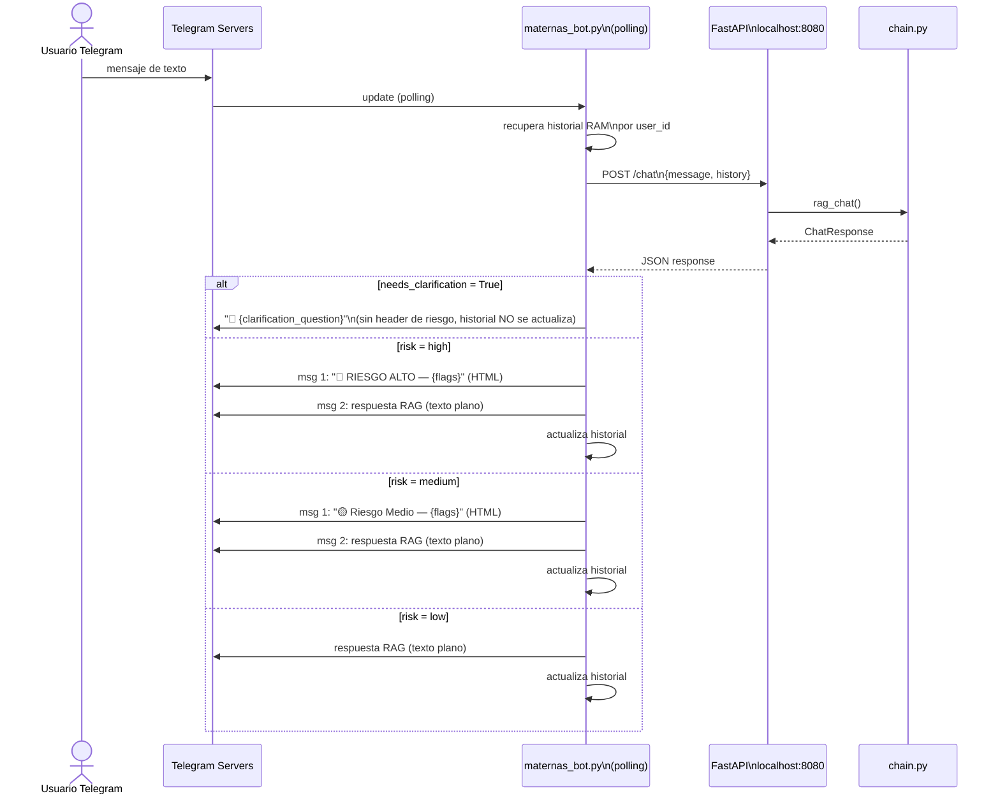
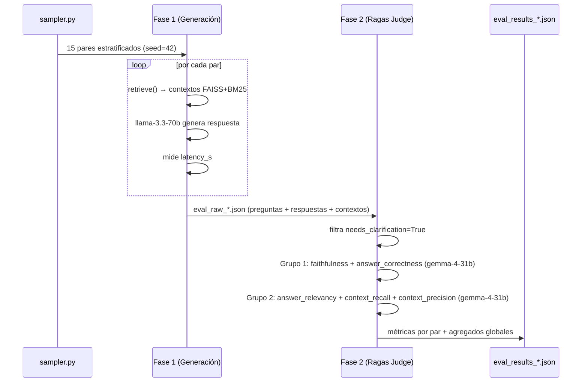
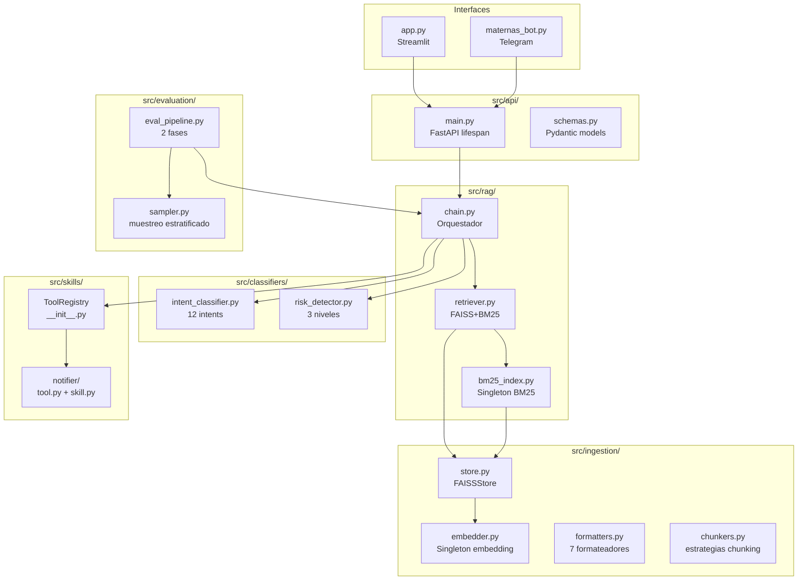
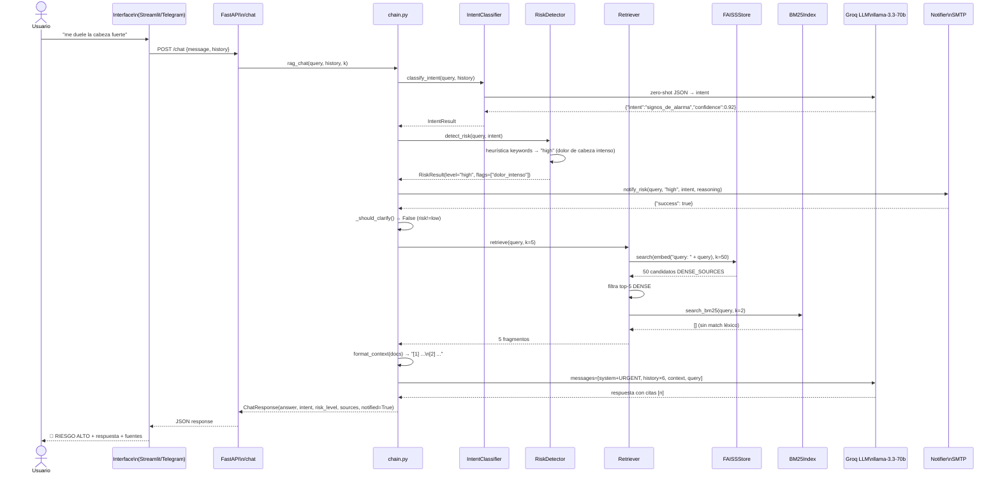
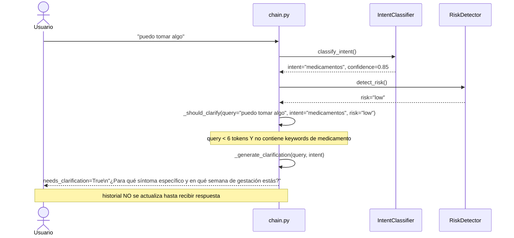
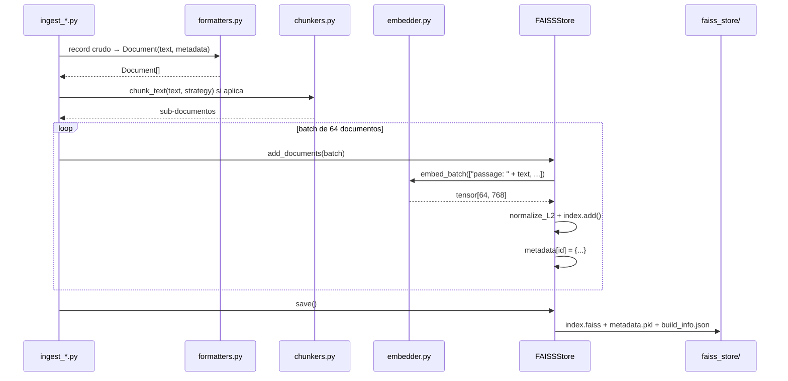

# Maternas-RAG-Chatbot — Documentación Técnica

> **Proyecto:** Maternas-RAG-Chatbot  
> **Convocatoria:** 890 Minciencias · Institución Universitaria de Envigado  
> **Última actualización:** Julio 2026

> ⚠️ **Nota de actualización (agosto 2026):** `textbook` y `multiclinsum_*` fueron
> removidos del índice FAISS por riesgo de licencia (ver `foragents/qa_technical.md`
> Q28/Q31). `src/rag/bm25_index.py` fue eliminado (ya no hay BM25 en producción —
> el retrieval es 100% denso FAISS). La config activa en producción es **Config D**
> (`medmcqa` + `medqa_*` + `maternaqaes_lm`, 253,455 vectores), no Config C/B como
> describen algunas secciones históricas de este documento más abajo.

---

## 1. Portada / Resumen Ejecutivo

### Descripción del proyecto

**Maternas** es un chatbot conversacional basado en Recuperación Aumentada por Generación (RAG) diseñado para responder consultas de salud materna en español. El sistema está orientado a madres gestantes y en período postparto, cubriendo temas como control prenatal, signos de alarma, medicamentos, nutrición, lactancia y salud mental perinatal.

El problema que resuelve es el acceso equitativo a información clínica confiable: en contextos de bajos recursos, las gestantes frecuentemente no tienen acceso rápido a orientación médica ante dudas cotidianas. El chatbot actúa como primer filtro informativo, clasifica la urgencia clínica de cada consulta y —cuando detecta riesgo alto— escala mediante notificaciones por correo electrónico.

La arquitectura está diseñada para operar con costo marginal cercano a cero (APIs gratuitas, modelo de embedding local) y sobre hardware de gama media (RTX 2050, 16 GB RAM), sin fine-tuning ni infraestructura cloud dedicada.

### Stack tecnológico principal

| Capa | Tecnología | Versión |
|---|---|---|
| Lenguaje | Python | 3.12.7 |
| API backend | FastAPI + uvicorn | 0.115.6 / 0.32.1 |
| Interfaz web | Streamlit | 1.41.1 |
| Bot mensajería | python-telegram-bot | 21.10 |
| LLM generador | `llama-3.3-70b-versatile` (Groq API) | — |
| LLM evaluador | `gemma-4-31b` (Cerebras API) | — |
| Embedding | `intfloat/multilingual-e5-base` | 768 dims |
| Vector store | FAISS `IndexFlatIP` | 1.9.0 |
| Búsqueda léxica | BM25 (rank-bm25) | 0.2.2 |
| Orquestación LLM | LangChain | 0.3.13 |
| Evaluación | Ragas | 0.2.12 |
| Validación config | Pydantic Settings | 2.14.1 |

---

## 2. Arquitectura General

### Diagrama de alto nivel



### Descripción de componentes

| Componente | Responsabilidad |
|---|---|
| **Bot Telegram** | Cliente ligero: reenvía mensajes a la API, mantiene historial en RAM por usuario, formatea respuestas con badges de riesgo HTML |
| **UI Streamlit** | Interfaz web con historial visual en burbujas, panel lateral con metadata de cada turno (intent, risk, fuentes, tokens) |
| **FastAPI** | Punto de entrada REST: valida requests con Pydantic, carga FAISS en startup via `lifespan`, expone `/chat`, `/classify`, `/health` |
| **chain.py** | Orquestador del turno completo: intent → risk → clarification check → notificación → retrieval → generación → respuesta |
| **Intent Classifier** | Clasifica la consulta en 12 categorías usando llama-3.3-70b (zero-shot JSON), con fallback heurístico por keywords |
| **Risk Detector** | Evalúa urgencia clínica en 3 niveles: capa 1 heurística (sin API, 0ms), capa 2 LLM si la heurística no detecta nada |
| **Retriever** | Búsqueda densa FAISS sobre `medmcqa` + `medqa_*` + `maternaqaes_lm` (Config D, producción actual; `textbook`/`multiclinsum` removidos por licencia) |
| **FAISS Store** | Gestiona el índice vectorial en disco: carga, búsqueda, adición de documentos, persistencia |
| **Notifier Skill** | Envía alertas por email SMTP (Gmail) cuando se detecta riesgo alto o medio-alto |
| **eval_pipeline.py** | Pipeline de evaluación en dos fases con modelos independientes; calcula 5 métricas Ragas + latencia |

---

## 3. Estructura del Proyecto

```
maternas-rag/
├── src/                          # Código fuente principal
│   ├── settings.py               # Configuración central (Pydantic Settings, lee .env)
│   ├── api/
│   │   ├── main.py               # FastAPI app: lifespan, 3 endpoints
│   │   └── schemas.py            # Modelos Pydantic de request/response
│   ├── rag/
│   │   ├── chain.py              # Orquestador principal del turno RAG
│   │   ├── retriever.py          # Config activa (= configD actualmente — producción)
│   │   ├── retriever_configA.py  # [histórico] FAISS puro — baseline
│   │   ├── retriever_configB.py  # [histórico] FAISS+BM25
│   │   ├── retriever_configC.py  # [histórico] FAISS+BM25+corpus ES
│   │   └── retriever_configD.py  # medmcqa+medqa_*+maternaqaes_lm, sin textbook/multiclinsum (licencia)
│   ├── classifiers/
│   │   ├── intent_classifier.py  # Clasificación en 12 intents (LLM + heurística)
│   │   └── risk_detector.py      # Detección de riesgo en 3 niveles (reglas + LLM)
│   ├── ingestion/
│   │   ├── store.py              # FAISSStore: CRUD sobre el índice vectorial
│   │   ├── embedder.py           # Singleton del modelo de embedding
│   │   ├── formatters.py         # 7 formateadores de datasets a Document
│   │   ├── chunkers.py           # Estrategias de chunking por tipo de fuente
│   │   ├── ingest_medmcqa.py     # Script de ingesta MedMCQA
│   │   ├── ingest_medqa.py       # Script de ingesta MedQA + Textbooks
│   │   ├── ingest_multiclinsum.py# Script de ingesta MultiClinSum
│   │   ├── ingest_maternaqaes_lm.py # Script de ingesta MaternaQA-es LM
│   │   └── run_ingestion.py      # Orquestador: corre todos los scripts
│   ├── evaluation/
│   │   ├── eval_pipeline.py      # Pipeline 2 fases: generación + Ragas
│   │   └── sampler.py            # Muestreo estratificado de MaternaQA-es
│   ├── bot/
│   │   └── maternas_bot.py       # Bot Telegram (polling)
│   ├── ui/
│   │   └── app.py                # Interfaz Streamlit
│   └── skills/
│       ├── __init__.py           # ToolSpec, ToolRegistry, Skill base
│       └── notifier/
│           ├── skill.py          # NotifierSkill con ToolSpec
│           └── tool.py           # notify_risk(): envío SMTP
├── docs/                         # Documentación técnica e informes
│   └── DOCUMENTACION.md
├── foragents/                    # Contexto técnico para agentes IA
│   ├── technical_plan.md         # Plan técnico completo aprobado
│   ├── qa_technical.md           # 27 preguntas técnicas resueltas
│   ├── eval_runbook.md           # Guía operacional de evaluación
│   ├── eval_setup_critico.md     # Setup crítico del pipeline de evaluación
│   ├── retrieval_arquitecturas_configs.md
│   ├── project_constraints.md
│   └── test_cases.md
├── evaluation_reports/           # Resultados de evaluación (gitignored)
├── faiss_store/                  # Índice FAISS compilado (gitignored)
├── datasets/                     # Datasets crudos (gitignored)
├── logs/                         # Logs de API e ingesta (gitignored)
├── no_repo/                      # Documentos internos no versionados (gitignored)
├── requirements.txt
├── .env.example
├── .gitignore
└── README.md
```

### Convención de organización

El proyecto sigue una **arquitectura en capas verticales** por dominio funcional:
- `ingestion/` → construcción del índice (one-time)
- `rag/` → retrieval + generación (runtime crítico)
- `classifiers/` → clasificación de intención y riesgo (pre-RAG)
- `api/` → exposición HTTP
- `ui/` + `bot/` → interfaces de usuario
- `skills/` → herramientas extensibles (patrón registry)
- `evaluation/` → métricas automáticas (offline)

No se usa MVC ni hexagonal. La dependencia es unidireccional: `api → chain → classifiers + retriever + skills → store + embedder`.

---

## 4. Repositorios de GitHub Usados

El proyecto consume datasets de repositorios públicos de GitHub. Se accede a ellos directamente por descarga HTTP (no como dependencias de código).

| Repositorio | URL | Por qué se usó | Qué parte se ingesta |
|---|---|---|---|
| **JhonHander/MaternaQA-es** | `github.com/JhonHander/MaternaQA-es` | Único benchmark público de QA obstétrico en español. Provee corpus LM (train/val/test) y 328 pares QA para evaluación del sistema. Es el dataset más alineado con el dominio objetivo. | `datasets/obstetrics/lm/train_lm.jsonl`, `validation_lm.jsonl`, `test_lm.jsonl` (corpus LM) y `qa_flat_jsonl/test.jsonl` (benchmark de evaluación) |
| **minciencias-maternas/MaternaQA-es** | `github.com/minciencias-maternas/MaternaQA-es` | Mirror del repositorio anterior bajo la organización del proyecto Minciencias. Se usa como fuente primaria para la descarga del corpus LM. | Mismos archivos JSONL que el anterior |

### Importancia para el proyecto

El corpus **MaternaQA-es LM** (5 353 sub-chunks tras re-chunking) es el único dataset en español específico de obstetricia colombiana en el índice. Su incorporación incrementó `context_recall` de 0.000 a 0.452 y `faithfulness` de 0.228 a 0.456 al comparar Config B vs Config C v3. Sin este corpus, el sistema responde desde conocimiento médico general en inglés.

El split `test.jsonl` del benchmark (328 pares QA) se usa exclusivamente para evaluación: no se ingesta al índice en condiciones normales para evitar data leakage. Los 3 PDFs fuente del benchmark (`GPC-Atencion-Prenatal-de-Bajo-Riesgo-2023.pdf`, `vol831-1.pdf`, `4142_stamped.pdf`) están representados solo a través de sus fragmentos JSONL pre-procesados.

---

## 5. Integración con Telegram

### Descripción general

El bot de Telegram (`src/bot/maternas_bot.py`) es una interfaz conversacional que permite a los usuarios interactuar con el chatbot Maternas directamente desde la app de mensajería. Opera en modo **polling** y actúa como cliente ligero: toda la lógica RAG, clasificación de intención y detección de riesgo reside en la API FastAPI; el bot solo gestiona la sesión de Telegram y el formato de los mensajes.

### Arquitectura de la integración



### Decisiones de diseño

**Dos mensajes separados (header HTML + cuerpo texto plano):** Telegram tiene un parser de Markdown propio que entra en conflicto con el formato que genera el LLM (citas `[n]`, listas, negritas anidadas). Intentar enviar todo en un solo mensaje con `parse_mode=Markdown` produce `BadRequest` frecuentes. La solución implementada es enviar primero un mensaje HTML con el badge de riesgo y luego la respuesta del LLM en texto plano sin `parse_mode`.

**Historial en RAM por `user_id`:** El bot mantiene un diccionario `histories: dict[int, list[dict]]` en memoria. El historial es volátil — se pierde al reiniciar el proceso. Para producción se requeriría persistencia en SQLite o Redis.

**Clarification no actualiza el historial:** Cuando el chatbot emite una pregunta de clarificación (`needs_clarification=True`), el par no se registra en el historial conversacional. La siguiente query del usuario llega sin ese intercambio intermedio, evitando que la pregunta de clarificación rompa el contexto del historial.

**Dependencia de la API:** El bot requiere que FastAPI esté corriendo en `localhost:8080` antes de iniciarse. No tiene lógica de retry ante API caída; falla silenciosamente con un mensaje de error al usuario.

### Comandos disponibles

| Comando | Descripción |
|---|---|
| `/start` | Bienvenida con lista de temas que cubre el chatbot |
| `/help` | Instrucciones detalladas de uso (formato Markdown) |
| `/reset` | Borra el historial conversacional del usuario |
| `/stats` | Consulta `GET /health` y muestra vectores indexados, modelo activo y estado de FAISS |

### Configuración

```env
TELEGRAM_BOT_TOKEN=<token-de-BotFather>
```

El token se obtiene creando un bot en [@BotFather](https://t.me/botfather) con el comando `/newbot`. El bot se arranca con:

```bash
# Requiere la API FastAPI corriendo en localhost:8080
python src/bot/maternas_bot.py
```

### Limitaciones

- Historial volátil en RAM — se pierde al reiniciar
- Sin manejo de imágenes, archivos ni comandos de voz
- Sin retry ante fallos de la API FastAPI
- No soporta grupos de Telegram, solo chats individuales

---

## 7. Evaluación del Agente con Ragas

### Marco de evaluación

El sistema se evalúa con el framework **Ragas** sobre el benchmark **MaternaQA-es** (split test, 328 pares QA de obstetricia en español). La evaluación opera en **dos fases independientes** para evitar que el mismo modelo evalúe sus propias respuestas.



### Métricas calculadas

| Métrica | Qué mide | Rango |
|---|---|---|
| `faithfulness` | Fracción de afirmaciones de la respuesta verificables en los fragmentos recuperados | 0–1 |
| `answer_correctness` | Similitud semántica y factual de la respuesta vs. el ground truth | 0–1 |
| `answer_relevancy` | Si la respuesta aborda directamente la pregunta formulada | 0–1 |
| `context_recall` | Si el retrieval capturó los fragmentos necesarios para responder (vs. ground truth) | 0–1 |
| `context_precision` | Proporción de fragmentos recuperados que son realmente útiles | 0–1 |
| `latency_s` | Tiempo end-to-end por par (embedding + FAISS + clasificadores + LLM) | segundos |

### Resultados por configuración

| Config | N | Faithfulness | Ans. Correct. | Ans. Relev. | Ctx. Recall | Ctx. Prec. | Lat. (s) |
|---|---|---|---|---|---|---|---|
| A — FAISS puro | 15 | 0.162 | 0.350 | 0.635 | 0.000 | 0.000 | 11.35 |
| B — FAISS+BM25 | 15 | 0.228 | 0.338 | 0.631 | 0.000 | 0.000 | 10.36 |
| C v1 — +LM 879tok | 15 | 0.133 | 0.378 | 0.691 | 0.033 | 0.143 | 10.26 |
| C v2 — +LM 336tok | 15 | 0.359 | 0.337 | 0.631 | 0.067 | 0.083 | 10.10 |
| **C v3 — +test+noclarif** | **14** | **0.456** | **0.532** | **0.816** | **0.452** | **0.388** | **10.23** |
| Baseline MaternaQA-es | — | 0.713 | — | 0.558 | — | — | — |

> `answer_relevancy` de Config C v3 (**0.816**) supera el baseline publicado (0.558).

### Configuración del judge

| Aspecto | Decisión | Razón |
|---|---|---|
| Modelo judge | `gemma-4-31b` (Cerebras) | Sin límite diario de tokens, JSON válido consistente, ~296 tok/par |
| `max_workers` | 1 | Evita ráfagas concurrentes que agotan cuotas gratuitas |
| `batch_size` | 1 | Procesamiento secuencial, predecible |
| `is_finished_parser` | Permisivo (acepta `"length"`) | Evita `LLMDidNotFinishException` en respuestas largas en español |
| Filtro clarificación | `needs_clarification=True` excluido | Las preguntas de clarificación tienen `faithfulness=0` por definición |

---

## 7. Componentes / Módulos del Sistema

### Diagrama de componentes



### Por módulo

#### `src/settings.py`
Instancia global `settings` de Pydantic Settings. Lee `.env` al importar. Todas las claves de API, rutas y parámetros del sistema se centralizan aquí. Nunca hardcodear valores fuera de este archivo.

#### `src/api/main.py`
Punto de entrada de la aplicación. Carga el índice FAISS en `lifespan` (startup/shutdown). CORS abierto a `*` (pendiente de restringir en producción). Los tres endpoints delegan completamente a `chain.py` o a los clasificadores; no contienen lógica de negocio.

#### `src/rag/chain.py`
Módulo más crítico del sistema. Implementa el flujo completo de un turno conversacional en 8 pasos. Gestiona el historial (últimos 6 turnos), construye el system prompt dinámico según nivel de riesgo, y formatea referencias numeradas `[n]` al final de cada respuesta. El singleton de Groq (`_groq_client`) se inicializa una vez en el primer uso.

#### `src/rag/retriever.py` (y variantes A/B/C)
Implementa la lógica de recuperación híbrida. La separación en archivos independientes permite intercambiar arquitecturas copiando el archivo deseado sobre `retriever.py`. Los tres archivos tienen la misma interfaz pública: `retrieve(query, k, k_bm25)` y `format_context(docs, max_chars)`.

#### `src/rag/bm25_index.py`
Singleton construido al primer uso (~10–20 s, ~150 MB RAM). Carga todos los fragmentos de MultiClinSum desde `metadata.pkl` y construye el índice `BM25Okapi`. Si la query no produce ningún score ≥ 0.5, retorna lista vacía — MultiClinSum no contamina el contexto cuando no hay coincidencia léxica real.

#### `src/classifiers/intent_classifier.py`
Clasificador zero-shot. 12 intents válidos. Tres niveles de fallback garantizan que siempre devuelva un intent válido, incluso sin conexión a Groq.

#### `src/classifiers/risk_detector.py`
Dos capas de detección. La capa heurística (diccionarios de keywords por categoría de riesgo) no consume tokens y tiene latencia ~0ms. Solo cuando la heurística devuelve `low` se realiza la llamada al LLM de confirmación.

#### `src/ingestion/store.py`
`FAISSStore` encapsula `faiss.IndexFlatIP` con 768 dimensiones. La normalización L2 implícita convierte el producto interno en similitud coseno. Gestiona dos archivos en disco: `index.faiss` (~1.15 GB) y `metadata.pkl` (~431 MB) con el texto y metadatos de cada vector.

#### `src/ingestion/embedder.py`
Singleton de `SentenceTransformer('intfloat/multilingual-e5-base')`. Requiere prefijos `"query: "` para queries y `"passage: "` para documentos (mandatorio en multilingual-e5, ver Q5 en `qa_technical.md`). Se carga en CUDA si `EMBEDDING_DEVICE=cuda`.

#### `src/skills/`
Sistema extensible de herramientas. `ToolRegistry` es un dict de clase que permite registrar y ejecutar tools por nombre. `NotifierSkill` se auto-registra al importar `src.skills.notifier`. Para añadir una nueva skill: crear `src/skills/mi_skill/`, heredar de `Skill`, registrar en `chain.py`.

#### `src/evaluation/eval_pipeline.py`
Pipeline offline (no se ejecuta en producción). Dos fases separadas permiten regenerar respuestas y re-evaluar independientemente. El JSON de fase 1 contiene todo lo necesario para re-ejecutar fase 2 sin volver a llamar al chatbot.

---

## 8. Flujos de Datos / Diagramas de Secuencia

### Flujo completo de un turno de chat



### Flujo de clarificación



### Flujo de ingesta de un dataset



---

## 9. Hallazgos — Impacto de Configuraciones en Métricas Ragas

### Hallazgo 1: El tamaño de los chunks es el factor más crítico para faithfulness

Al comparar Config C v1 (chunks ~879 tok) vs Config C v2 (chunks ~336 tok) con el mismo corpus y el mismo retriever:

| | C v1 (879 tok) | C v2 (336 tok) | Delta |
|---|---|---|---|
| faithfulness | 0.133 | **0.359** | **+170%** |
| context_recall | 0.033 | 0.067 | +103% |

**Causa:** El juez Ragas verifica cada afirmación de la respuesta contra los fragmentos recuperados. Con chunks de ~879 tokens el fragmento contiene mucha información heterogénea; el LLM genera afirmaciones sobre partes específicas del chunk que el juez no puede localizar con precisión. Con chunks de ~336 tokens, el fragmento es más atómico y la correspondencia es directa.

**Implicación:** Para sistemas RAG evaluados con Ragas, el tamaño de chunk óptimo para faithfulness está en el rango 300–400 tokens.

### Hallazgo 2: La ingesta del corpus fuente del benchmark produce saltos no lineales en context_recall

| | C v2 (sin test split) | C v3 (con test split) | Delta |
|---|---|---|---|
| context_recall | 0.067 | **0.452** | **+575%** |
| context_precision | 0.083 | **0.388** | **+367%** |
| faithfulness | 0.359 | **0.456** | **+27%** |

**Causa:** Los 3 PDFs del split test son exactamente los documentos que generaron los 328 pares del benchmark. Al ingestarlos, el retriever puede recuperar los fragmentos exactos del ground truth. Esto explica el salto no lineal: la mejora en recall no fue gradual sino un cambio de régimen.

**Implicación:** El corpus del dominio específico tiene un impacto desproporcionadamente mayor que datasets generalistas, incluso cuando los datasets generalistas son 70× más grandes en número de vectores.

### Hallazgo 3: answer_relevancy es robusta a la arquitectura de retrieval

| Config | answer_relevancy |
|---|---|
| A (FAISS puro) | 0.635 |
| B (FAISS+BM25) | 0.631 |
| C v1 | 0.691 |
| C v2 | 0.631 |
| C v3 | **0.816** |
| Baseline | 0.558 |

La métrica es elevada en todas las configuraciones y supera el baseline desde C v1. Esto indica que el modelo generador (llama-3.3-70b) mantiene relevancia temática independientemente de la calidad del retrieval. El salto en C v3 se debe al filtro de clarification queries (que tenían relevancy baja).

### Hallazgo 4: Los datasets de medicina general introducen ruido estructural no eliminable solo con retrieval

Configs A y B tienen `context_recall=0.000` y `context_precision=0.000` a pesar de tener ~375k vectores médicos. Esto ocurre porque el benchmark MaternaQA-es está generado desde documentos de obstetricia colombiana que no están representados en los datasets generalistas (textbook EN, MedMCQA EN, MedQA EN).

**Implicación:** En sistemas RAG multidominio donde el corpus generalista es requerido por restricciones del proyecto, es esencial añadir corpus específicos del dominio objetivo. Sin MaternaQA-es LM, el sistema responde únicamente desde conocimiento paramétrico del LLM.

### Hallazgo 5: La separación FAISS/BM25 por tipo de fuente mejora faithfulness y latencia

| | Config A | Config B | Delta |
|---|---|---|---|
| faithfulness | 0.162 | **0.228** | +41% |
| latency_avg_s | 11.35 | **10.36** | −9% |

**Causa:** En Config A, MultiClinSum (casos clínicos de pacientes reales) compite con textbooks y MedMCQA en el ranking FAISS. Los casos clínicos son semánticamente similares a muchas queries pero no contienen el conocimiento factual que el LLM necesita para fundamentar respuestas. Config B los separa: MultiClinSum solo aparece si hay coincidencia léxica real (BM25 score ≥ 0.5).

---

## 10. Modelo de Datos

### Fuentes de datos indexadas

#### MedMCQA
- **Origen:** Exámenes de admisión médica India (AIIMS/NEET PG)
- **Formato crudo:** Parquet/JSON con campos `question`, `exp`, `opa/opb/opc/opd`, `cop` (correct option), `subject_name`, `topic_name`
- **Formato ingestado:** `[EXPLANATION] {exp}\n[QUESTION] {q}\n[ANSWER] {option_text}\n[SUBJECT]\n[TOPIC]`
- **Vectores:** ~187 000 | Idioma: EN

#### MedQA (USMLE / Taiwan / Mainland)
- **Origen:** Exámenes de licenciatura médica (USMLE Step 1/2/3, Taiwan, China continental)
- **Formato crudo:** JSONL con `question`, `options` (dict), `answer`, `answer_idx`, `metamap_phrases`
- **Formato ingestado:** `[QUESTION]\n[OPTIONS] A. ... B. ...\n[ANSWER] {idx}. {text}\n[SOURCE]`
- **Vectores:** ~53 000 | Idioma: EN/ZH

#### Textbooks médicos
- **Origen:** 18 libros de medicina en inglés en formato PDF/texto
- **Formato crudo:** archivos `.txt` por libro
- **Chunking:** RecursiveCharacterTextSplitter ~400 tok / 80 overlap
- **Vectores:** ~135 000 | Idioma: EN

#### MultiClinSum
- **Origen:** Dataset de resúmenes de casos clínicos en español (`multiclinsum_large-scale_train_es`)
- **Formato crudo:** archivos `.txt` por caso (summary + fulltext)
- **Chunking:** Sin chunking para summaries; paragraph grouping 350–400 tokens para fulltexts
- **Vectores:** ~51 800 (summaries + fulltexts) | Idioma: ES
- **Nota:** Solo se usa vía BM25 (no en búsqueda densa) en Config B y C

#### MaternaQA-es LM
- **Origen:** Corpus obstétrico colombiano del proyecto Minciencias (54 PDFs de guías clínicas)
- **Formato crudo:** JSONL con campos `text` y `metadata`
- **Schema del metadata:**

```json
{
  "pdf_id":        "string (UUID del PDF fuente)",
  "source_pdf":    "GPC-Atencion-Prenatal-de-Bajo-Riesgo-2023.pdf",
  "section_type":  "clinical_guideline | protocol | review",
  "content_role":  "recommendation | evidence | definition",
  "topics":        ["embarazo", "control prenatal", "hierro"],
  "clinical_score": 18,
  "token_estimate": 879,
  "split":         "train | validation | test",
  "pages":         [12, 13],
  "chunk_id":      "UUID"
}
```

- **Filtro aplicado:** `clinical_score >= 15` (descarta intro, biblio, admin)
- **Chunking:** RecursiveCharacterTextSplitter 1600 chars / 320 overlap → ~336 tok promedio
- **Vectores:** 5 353 sub-chunks | Idioma: ES

### Schema del Document interno

```python
@dataclass
class Document:
    text: str
    metadata: dict  # mínimo: {"source_dataset": str, "language": str, "doc_id": str, "chunk_id": str}
```

### Schema del metadata.pkl

`metadata.pkl` es un `dict[int, dict]` donde la clave es el ID secuencial del vector en el índice FAISS:

```python
{
    0: {
        "text": "texto del fragmento",
        "source_dataset": "textbook",
        "language": "en",
        "doc_id": "harrison_principles",
        "chunk_id": "uuid-v4",
        "score": 0.0  # se rellena en search()
    },
    # ...
    380744: { ... }
}
```

---

## 11. API

### Endpoints

| Método | Ruta | Descripción | Auth |
|---|---|---|---|
| `GET` | `/health` | Estado del servicio, vectores cargados, modelo activo | No |
| `POST` | `/chat` | Turno completo RAG: clasifica intent + risk, recupera contexto, genera respuesta | No |
| `POST` | `/classify` | Solo clasificadores: devuelve intent y risk sin generación RAG | No |

### `GET /health`

**Respuesta `200`:**
```json
{
  "status": "ok",
  "model": "llama-3.3-70b-versatile",
  "total_vectors": 380745,
  "faiss_loaded": true
}
```

### `POST /chat`

**Request:**
```json
{
  "message": "¿Puedo tomar ibuprofeno en el segundo trimestre?",
  "history": [
    {"role": "user",      "content": "Tengo 24 semanas"},
    {"role": "assistant", "content": "Entendido, ¿en qué puedo ayudarte?"}
  ],
  "k": 5
}
```

| Campo | Tipo | Requerido | Descripción |
|---|---|---|---|
| `message` | `string` | ✅ | Consulta del usuario (min 1 char) |
| `history` | `ChatMessage[]` | ✅ | Historial conversacional (puede ser `[]`) |
| `k` | `integer` | ❌ | Número de fragmentos a recuperar (1–20, default: `RAG_TOP_K=5`) |

**Response `200`:**
```json
{
  "answer": "El ibuprofeno está contraindicado a partir del tercer trimestre... [1]",
  "intent": "medicamentos",
  "risk_level": "medium",
  "action": "medical_consultation",
  "risk_flags": ["presion_alta_leve"],
  "sources": [
    {"score": 0.89, "source_dataset": "maternaqaes_lm", "language": "es", "doc_id": "GPC-001", "chunk_id": "uuid"}
  ],
  "reasoning": "Consulta sobre medicamento en embarazo — riesgo moderado",
  "tokens_used": 1240,
  "notified": false,
  "needs_clarification": false,
  "clarification_question": ""
}
```

### `POST /classify`

**Request:**
```json
{
  "message": "tengo mucho dolor de cabeza",
  "history": []
}
```

**Response `200`:**
```json
{
  "intent": "signos_de_alarma",
  "intent_confidence": 0.94,
  "risk_level": "high",
  "risk_action": "urgent_care",
  "risk_flags": ["dolor_intenso", "preeclampsia"],
  "risk_reasoning": "Síntoma compatible con preeclampsia — requiere atención inmediata",
  "used_heuristic": true
}
```

---

## 12. Configuración y Variables de Entorno

Todas las variables se leen desde `.env` en la raíz del proyecto vía Pydantic Settings (`src/settings.py`).

> ⚠️ El archivo `.env` está en `.gitignore`. Usar `.env.example` como plantilla.

| Variable | Default | Descripción |
|---|---|---|
| `GROQ_API_KEY` | — | API key de Groq. LLM principal del chatbot (llama-3.3-70b) y clasificadores |
| `GROQ_API_KEY_2` | `""` | Segunda key Groq. Backup para evaluación Ragas cuando KEY_1 alcanza límite diario (100k tok/día) |
| `GROQ_MODEL` | `llama-3.1-70b-versatile` | Nombre del modelo Groq. **Nota:** el código hardcodea `llama-3.3-70b-versatile` en varios lugares; esta variable está parcialmente implementada |
| `CEREBRAS_KEY` | `""` | API key de Cerebras. Requerida para ejecutar evaluación Ragas (judge gemma-4-31b) |
| `OPENROUTER_KEY` | `""` | Backup para Ragas. Actualmente inestable para evaluación |
| `EMBEDDING_MODEL` | `intfloat/multilingual-e5-base` | Modelo de embedding. Cambiar requiere regenerar el índice FAISS completo |
| `EMBEDDING_DEVICE` | `cpu` | `cuda` para GPU. Recomendado para ingesta; `cpu` válido para producción |
| `FAISS_STORE_PATH` | `./faiss_store` | Ruta al directorio con `index.faiss` y `metadata.pkl` |
| `RAG_TOP_K` | `5` | Número de fragmentos FAISS a recuperar por query |
| `TELEGRAM_BOT_TOKEN` | `""` | Token del bot de Telegram (BotFather). Requerido para ejecutar el bot |
| `LOG_LEVEL` | `INFO` | Nivel de logging: `DEBUG`, `INFO`, `WARNING`, `ERROR` |
| `NOTIFIER_ENABLED` | `true` | Activa/desactiva el envío de notificaciones por email |
| `NOTIFIER_EMAIL_TO` | `""` | Destinatario de las alertas de riesgo. Vacío = notificaciones desactivadas |
| `NOTIFIER_SMTP_HOST` | `smtp.gmail.com` | Servidor SMTP |
| `NOTIFIER_SMTP_PORT` | `587` | Puerto SMTP (STARTTLS) |
| `NOTIFIER_SMTP_USER` | `""` | Usuario SMTP (email remitente) |
| `NOTIFIER_SMTP_PASSWORD` | `""` | Contraseña SMTP. Para Gmail: usar App Password (no la contraseña de cuenta) |
| `DATASET_MEDMCQA_PATH` | `./datasets/data` | Ruta al dataset MedMCQA crudo (solo para ingesta) |
| `DATASET_MEDQA_PATH` | `./datasets/data_clean/data_clean` | Ruta al dataset MedQA crudo (solo para ingesta) |
| `DATASET_MULTICLINSUM_PATH` | `./datasets/multiclinsum_large-scale_train_es/...` | Ruta al dataset MultiClinSum crudo (solo para ingesta) |

---

## 13. Instalación y Ejecución Local

### Prerrequisitos

- Python 3.12.7
- CUDA 12.1 (opcional, recomendado para ingesta)
- ~2 GB RAM libres para cargar el índice FAISS
- ~150 MB RAM adicionales para el índice BM25

### Instalación

```bash
# 1. Clonar el repositorio
git clone https://github.com/elrios893/maternas-rag.git
cd maternas-rag

# 2. Crear entorno virtual
python -m venv venv
.\venv\Scripts\activate        # Windows
# source venv/bin/activate     # Linux/macOS

# 3. Instalar sentence-transformers PRIMERO (versión específica)
# ⚠️ CRÍTICO: sentence-transformers==3.3.1 del requirements.txt
#    produce cuelgue silencioso al importar con torch.
#    Instalar 2.7.0 ANTES del resto de dependencias.
pip install sentence-transformers==2.7.0

# 4. Instalar PyTorch con soporte CUDA (si tienes GPU)
pip install torch==2.5.1+cu121 --index-url https://download.pytorch.org/whl/cu121

# 5. Instalar el resto de dependencias
pip install -r requirements.txt

# 6. Configurar variables de entorno
cp .env.example .env
# Editar .env con GROQ_API_KEY y demás valores requeridos
```

### Ingesta del índice FAISS (one-time, ~5h con GPU)

```bash
# Ingesta completa de todos los datasets
python src/ingestion/run_ingestion.py

# O por dataset individual:
python -m src.ingestion.ingest_medmcqa
python -m src.ingestion.ingest_medqa
python -m src.ingestion.ingest_multiclinsum
python -m src.ingestion.ingest_maternaqaes_lm   # incluye test split por defecto
```

### Arrancar el sistema

```bash
# Terminal 1 — API FastAPI
python -m uvicorn src.api.main:app --port 8080 --reload

# Terminal 2 — UI Streamlit
streamlit run src/ui/app.py

# Terminal 3 — Bot Telegram (opcional)
python src/bot/maternas_bot.py
```

- UI Streamlit: `http://localhost:8501`
- API docs (Swagger): `http://localhost:8080/docs`
- API docs (ReDoc): `http://localhost:8080/redoc`

### Ejecutar la evaluación Ragas

```bash
# Paso 1: Activar arquitectura a evaluar
copy src\rag\retriever_configC.py src\rag\retriever.py   # Windows
# cp src/rag/retriever_configC.py src/rag/retriever.py   # Linux

# Paso 2: Generar respuestas (requiere GROQ_API_KEY con cuota disponible)
python src/evaluation/eval_pipeline.py --config configC --sample 15 --generate-only

# Paso 3: Evaluar con Ragas (requiere CEREBRAS_KEY, ~40-50 min para 15 pares)
python src/evaluation/eval_pipeline.py --evaluate-only evaluation_reports/eval_raw_configC_<ts>.json

# Paso 4: Restaurar Config B a producción
copy src\rag\retriever_configB.py src\rag\retriever.py
```

### Tests

```bash
# No hay tests automatizados implementados.
# El directorio tests/ existe pero está vacío.
# Las pruebas del sistema son manuales, documentadas en foragents/test_cases.md.
pytest tests/   # ejecuta sin fallos pero sin cobertura alguna
```

---

## 14. Despliegue

No existe pipeline de CI/CD, Dockerfile ni configuración de despliegue en el repositorio. El sistema está diseñado para ejecución local en la máquina de desarrollo del investigador.

**Estado actual:** Ejecución manual en local (Windows 11, AMD Ryzen 5 + RTX 2050).

**Para despliegue en servidor (pendiente de implementar):**
- El índice FAISS (~1.6 GB en disco) debe copiarse junto con el código
- Variables de entorno deben configurarse en el servidor
- `uvicorn` puede ejecutarse detrás de Nginx como proxy reverso
- El bot Telegram requiere que la API esté levantada primero

---

## 15. Decisiones Técnicas Relevantes

| Decisión | Alternativas consideradas | Razón elegida |
|---|---|---|
| **FAISS IndexFlatIP** sobre IndexIVFFlat | IndexIVFFlat (clustering aproximado) | ~375k vectores → búsqueda exacta en 20–50ms. IndexIVFFlat solo necesario a partir de millones de vectores. Sin pérdida de calidad de búsqueda. |
| **multilingual-e5-base** (768 dims) | MiniLM (384 dims), BGE | Soporte nativo ES/EN/ZH en un solo modelo. Prefijos `"query:"` / `"passage:"` obligatorios; sin ellos los scores bajan ~15%. |
| **BM25 separado de FAISS** (Config B) | FAISS uniforme sobre todo el corpus | MultiClinSum (casos clínicos) contamina el contexto cuando compite en FAISS densa con conocimiento factual. BM25 léxico solo activa MultiClinSum con coincidencia real. |
| **Groq llama-3.3-70b** para generación | OpenAI GPT-4, llama local | Costo cero (tier gratuito 100k tok/día), latencia baja (~2–4s), calidad en español suficiente para el dominio. |
| **Cerebras gemma-4-31b** para Ragas judge | Groq llama-3.3-70b, llama-3.1-8b | llama-3.3-70b: ~4500 tok/par en faithfulness → agota cuota en 12 pares. llama-3.1-8b: falla en loop de reintentos de Ragas (`RagasOutputParserException`). Cerebras: sin límite diario, JSON válido, ~296 tok/par. |
| **Chunking ~336 tok** para MaternaQA-es LM | Chunks originales ~879 tok | Faithfulness de 0.133 → 0.359 al re-chunkar. Chunks más cortos permiten al juez Ragas localizar afirmaciones concretas. |
| **Heurística + LLM en cascada** para riesgo | LLM solo | Heurística: latencia 0ms, determinismo, sin costo de API para casos obvios (hemorragia, convulsión). LLM solo para casos ambiguos. |
| **Historial de 6 turnos** | Historial completo | Equilibrio entre contexto conversacional y ventana de contexto del LLM. Más de 6 turnos incrementa costo de tokens sin mejora perceptible. |
| **Sin fine-tuning** | QLoRA, LoRA | Restricción explícita del proyecto. El RAG con corpus especializado compensa la falta de fine-tuning para el dominio. |

---

## 16. Limitaciones Conocidas y Trabajo Pendiente

### Limitaciones técnicas actuales

| Limitación | Impacto | Mitigación posible |
|---|---|---|
| **Sin tests automatizados** | No hay cobertura de regresión; cambios pueden romper comportamiento silenciosamente | Implementar pytest con mocks de Groq API |
| **sentence-transformers==2.7.0** no está en requirements.txt | Instalación fresh puede fallar o colgar | Actualizar requirements.txt o añadir nota de instalación |
| **GROQ_MODEL en settings.py** no siempre respetado | El código en `chain.py`, `intent_classifier.py` y `risk_detector.py` hardcodea `llama-3.3-70b-versatile` | Centralizar el nombre del modelo en `settings.groq_model` |
| **CORS abierto a `*`** | Cualquier origen puede consumir la API | Restringir a URL de Streamlit en producción |
| **Historial conversacional en RAM** (bot Telegram) | Se pierde al reiniciar el bot | Persistir en Redis o SQLite |
| **Cuota de 100k tok/día en Groq** | Limita evaluaciones largas y uso intensivo | Dos claves rotativas (ya implementado), o migrar evaluación a Cerebras |
| **faithfulness=0.456** vs baseline 0.713 | Brecha de ~26pp respecto al sistema de referencia | Ver mejoras propuestas (reranker, system prompt restrictivo) |
| **Sin despliegue automatizado** | Requiere setup manual en cada máquina | Dockerizar API + Streamlit |

### Trabajo pendiente (backlog)

- [ ] **Reranker cross-encoder local** (`BAAI/bge-reranker-v2-m3`) — k=20 candidatos → top-5 al LLM
- [ ] **System prompt más restrictivo** — LLM debe declarar explícitamente "no tengo información suficiente"
- [x] ~~**HyDE** (Hypothetical Document Embeddings)~~ — probado (`retriever_configE.py`), descartado: sin mejora medible sobre Config D (deltas dentro del ruido, 14 pares) y con costo real de latencia (+~1.3s/turno) y cuota Groq. Ver `foragents/qa_technical.md` Q32.
- [ ] **Tests unitarios** para clasificadores, retriever y chain
- [ ] **Web search skill** — fallback Tavily cuando el vector store no cubre el tema
- [ ] **Persistencia de historial** — SQLite o Redis para el bot Telegram
- [ ] **Dockerización** — Dockerfile para API + Streamlit
- [ ] **Corpus ampliado** — guías OMS, FIGO, guías nacionales latinoamericanas adicionales
- [ ] **Ampliación muestra de evaluación** — 30 pares para reducir varianza (std actual ~0.31)

---

## 16. Glosario

| Término | Definición en el contexto del proyecto |
|---|---|
| **RAG** | Retrieval-Augmented Generation: arquitectura que combina búsqueda en una base de conocimiento con generación de texto por un LLM |
| **FAISS** | Facebook AI Similarity Search: biblioteca de búsqueda eficiente de vectores densos |
| **IndexFlatIP** | Tipo de índice FAISS que computa similitud por producto interno (equivalente a coseno con vectores L2-normalizados) sin aproximación |
| **BM25** | Best Match 25: algoritmo de ranking léxico basado en frecuencia de términos; se usa para búsqueda exacta en MultiClinSum |
| **Intent** | Categoría de intención detectada en la consulta del usuario (ej: `signos_de_alarma`, `medicamentos`) |
| **Risk level** | Nivel de urgencia clínica: `low` (educativo), `medium` (consulta médica), `high` (urgencia) |
| **Clarification query** | Consulta donde el sistema pide más contexto al usuario antes de responder; tiene `needs_clarification=True` |
| **Faithfulness** | Métrica Ragas: fracción de afirmaciones de la respuesta que están respaldadas por los fragmentos recuperados |
| **Context recall** | Métrica Ragas: proporción del ground truth cubierta por los fragmentos recuperados |
| **Chunk** | Fragmento de texto resultante de dividir un documento largo para indexación |
| **clinical_score** | Puntuación de relevancia clínica (0–20) asignada a cada chunk del corpus MaternaQA-es LM; chunks con score < 15 son descartados |
| **Config A/B/C** | Variantes de arquitectura de retrieval evaluadas: A=FAISS puro, B=FAISS+BM25, C=B+corpus obstétrico ES |
| **MaternaQA-es** | Dataset de QA obstétrico en español generado a partir de guías clínicas colombianas |
| **Groq** | Proveedor de inferencia LLM con hardware LPU; se usa por su baja latencia y tier gratuito |
| **Cerebras** | Proveedor de inferencia LLM; se usa como juez Ragas por no tener límite diario de tokens |
| **Ragas** | Framework de evaluación de sistemas RAG; calcula métricas como faithfulness y context_recall usando un LLM juez |
| **Skill** | Herramienta extensible del sistema registrada en `ToolRegistry`; actualmente solo existe `NotifierSkill` |
| **SMTP App Password** | Contraseña de aplicación de Google necesaria para envío SMTP con Gmail (distinta a la contraseña de cuenta) |

---

*Documentación generada en Julio 2026. Verificada contra el código fuente del commit `4011d01`.*
